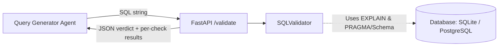
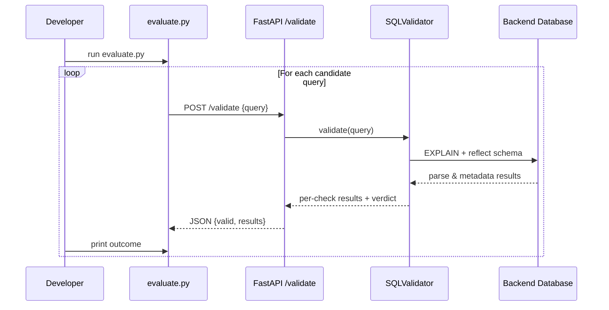

# Nexus SQL Validator - Wiki

Welcome to the **Nexus SQL Validator** wiki! This tool is designed to validate SQL queries against an academic database schema. It is available in two flavors based on your database backend preference:
- **PostgreSQL Version** (`sql_validator_agent`)
- **SQLite Version** (`sql_validator_agent_sqlite`)

This document outlines the prerequisites, the underlying data, how to use the tool, and provides architectural visualizations.

---

## 1. Prerequisites & Required Data

Before running the validator, you must set up the local environment and the database.

### System Prerequisites
- **Python**: 3.9+
- **Pip**: For installing dependencies.
- **Dependencies**: Install via `pip install -r requirements.txt` within the respective folder.

### Database Setup

The validator requires a populated academic database to perform its semantic checks. The provided `init_db.sql` scripts create the following tables and populate them with sample data:
- `Student`, `Semester`, `Subjects`, `Marks`, `Timetable`

#### Option A: PostgreSQL Setup
If you are using the `sql_validator_agent` folder:
1. Ensure PostgreSQL is installed and running.
2. Ensure you have the `psql` CLI tool available.
3. Create the database and load the data:
   ```bash
   createdb -U <user> academic_db
   psql -U <user> -d academic_db -f init_db.sql
   ```
*(You will need to update the `DB_URI` in `app.py` and `test_validator.py` with your credentials).*

#### Option B: SQLite Setup
If you are using the `sql_validator_agent_sqlite` folder:
1. Ensure the `sqlite3` CLI is available.
2. Initialize the database file:
   ```bash
   sqlite3 academic.db < init_db.sql
   ```
*(No further configuration is required as the URI defaults to `sqlite:///academic.db`).*

---

## 2. How to Use the Validator

The validator exposes a FastAPI endpoint to evaluate SQL queries. It performs four distinct checks:
1. **Syntax**: Uses the database's `EXPLAIN` engine.
2. **Semantics**: Ensures referenced tables exist.
3. **Data Range**: Checks logical constraints (e.g., year in 1–4).
4. **Security**: Scans for SQL injection patterns and dangerous keywords.

### Starting the Service
Navigate to your chosen validator directory and run:
```bash
python app.py
```
The service will start at `http://localhost:8000`.

### Validating a Query
You can test the validator by sending a POST request with a JSON payload containing the SQL query.

**Example using `curl`:**
```bash
curl -X POST "http://localhost:8000/validate" \
  -H "Content-Type: application/json" \
  -d "{\"query\": \"SELECT name, email FROM Student WHERE year = 1 AND semester = 1\"}"
```

### Expected Output
The API returns a JSON response indicating the overall validity and providing granular feedback for each check.

**Valid Query Output:**
```json
{
  "valid": true,
  "message": "Query is valid",
  "results": [
    {"check": "Syntax", "valid": true, "message": "Valid syntax"},
    {"check": "Semantics", "valid": true, "message": "All accessed tables exist."},
    {"check": "Data Range", "valid": true, "message": "Valid year range."},
    {"check": "Security", "valid": true, "message": "No obvious injection patterns found"}
  ]
}
```

**Using the Evaluator Script**
Both versions include an `evaluate.py` script. Leaving the server running, open another terminal and run `python evaluate.py`. It loops through a batch of sample queries, prints the API response for each, and gives a final tally of valid vs. invalid queries.

---

## 3. Architecture & Visualizations

The validator evaluates queries iteratively and can serve as a guardrail inside a larger Query generation loop.

### Validation Flow Architecture


### Batch Evaluation Sequence


These diagrams illustrate how the validator abstracts the database syntax mechanics and returns actionable feedback to either a developer or an automated agent.
