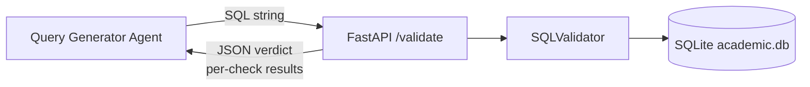
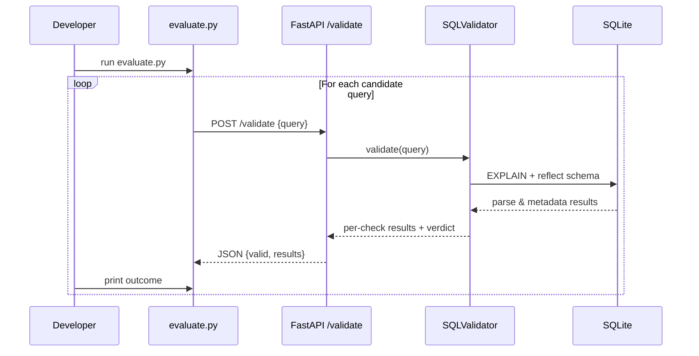

# SQL Validator Agent (SQLite)

A small FastAPI-based microservice plus a Python utility that validate SQL queries against an academic schema stored in a local SQLite database.

It performs four checks:

- Syntax (via database `EXPLAIN`)
- Semantics (referenced tables exist in the reflected schema)
- Data range (year in 1–4, semester in 1–8)
- Security (simple SQL injection / dangerous keyword heuristics)

---

## Prerequisites

- **Python**: 3.9+ (recommended)
- **SQLite** (the `sqlite3` CLI is usually bundled with Python/OS)
- **Pip** for installing Python dependencies
- **Network access** to `http://localhost:8000` (for the FastAPI service)

### Database prerequisites

1. Create the SQLite database file and load the schema + sample data from `init_db.sql`:

   ```bash
   cd sql_validator_agent_sqlite
   sqlite3 academic.db < init_db.sql
   ```

   This creates and populates:

   - `Student`
   - `Semester`
   - `Subjects`
   - `Marks`
   - `Timetable`

---

## Project structure

```text
sql_validator_agent_sqlite/
├── app.py            # FastAPI microservice exposing /validate (uses SQLite)
├── validator.py      # SQLValidator class with all checks
├── evaluate.py       # Batch evaluation script for candidate queries
├── test_validator.py # Pytest test cases for the validator
├── init_db.sql       # DDL + rich sample data for SQLite
├── requirements.txt  # Python dependencies
└── README.md         # This documentation
```

---

## Configuration

The SQLite database URI is already set up for you.

In **`app.py`**:

```python
DB_URI = "sqlite:///academic.db"
```

In **`test_validator.py`**:

```python
validator = SQLValidator("sqlite:///academic.db")
```

The `academic.db` file will be created in the `sql_validator_agent_sqlite` folder when you run the `sqlite3` command above.

---

## Installation & Setup (Instructions)

From the `sql_validator_agent_sqlite` folder:

1. **Install dependencies**

   ```bash
   pip install -r requirements.txt
   ```

2. **Initialize the SQLite database (if not already done)**

   ```bash
   sqlite3 academic.db < init_db.sql
   ```

3. **Run the FastAPI microservice**

   ```bash
   python app.py
   ```

   - Service URL: `http://localhost:8000`
   - Endpoint: `POST /validate`
   - Request body (JSON):

     ```json
     {"query": "SELECT name, email FROM Student WHERE year = 1 AND semester = 1"}
     ```

4. **Manual API test (optional)**

   Using `curl` (Windows PowerShell example):

   ```bash
   curl -X POST "http://localhost:8000/validate" ^
     -H "Content-Type: application/json" ^
     -d "{\"query\": \"SELECT name, email FROM Student WHERE year = 1 AND semester = 1\"}"
   ```

   Expected JSON for a valid query:

   ```json
   {
     "valid": true,
     "message": "Query is valid",
     "results": [
       {"check": "Syntax", "valid": true, "message": "..."},
       {"check": "Semantics", "valid": true, "message": "..."},
       {"check": "Data Range", "valid": true, "message": "..."},
       {"check": "Security", "valid": true, "message": "..."}
     ]
   }
   ```

5. **Run the batch evaluator**

   Open a second terminal (keep the FastAPI server running), then:

   ```bash
   cd sql_validator_agent_sqlite
   python evaluate.py
   ```

   The script will:

   - Loop through a list of candidate queries
   - POST each query to `/validate`
   - Print per-query results and a final summary like:

   ```json
   {
     "total": 10,
     "valid": 5,
     "invalid": 5
   }
   ```

6. **Run unit tests**

   ```bash
   cd sql_validator_agent_sqlite
   pytest test_validator.py -v
   ```

   These tests cover:

   - Valid query
   - Invalid year (data range)
   - SQL injection / dangerous query
   - Nonexistent table (semantics)
   - Syntax error (incomplete WHERE clause)

---

## How the system works (Architecture)

### High-level architecture



- **Query Generator Agent**: your upstream component that produces SQL queries.
- **FastAPI /validate**: receives a query, invokes the validator, and returns structured results.
- **SQLValidator**: implements syntax, semantics, data-range, and security checks.
- **SQLite**: provides the academic schema and SQL parser (via `EXPLAIN`).

### Evaluation flow (`evaluate.py`)



---

## Quick integration snippet (from another Python service)

If another Python service wants to validate queries directly:

```python
import requests

resp = requests.post(
    "http://localhost:8000/validate",
    json={"query": "SELECT * FROM Student WHERE year = 1"},
    timeout=10,
)

if resp.status_code == 200:
    data = resp.json()
    if data.get("valid"):
        print("Query accepted", data["results"])
    else:
        print("Unexpected invalid query", data["results"])
else:
    detail = resp.json().get("detail", {})
    print("Query rejected", detail)
```

This is the same contract used by `evaluate.py` and is suitable for hooking into your Query Generator Agent or other microservices.
